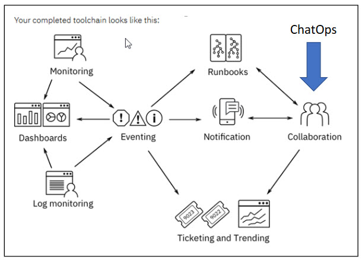

## ChatOps

----

### What is ChatOps ?

ChatOps is a collaboration model that connects people, tools, process, and automation into a transparent workflow

This flow connects the work that is needed, the work that is happening, and the work that was done in a persistent location that is staffed by people, bots, and related tools

----

### ChatOps tools

Tools like [Slack](https://slack.com) and [Mattermost](https://mattermost.com/) are great for ChatOps, but they are not the only tools that can be used

----

### What is a ChatOps bot ?

ChatOps bot is a bot that can be used to automate tasks and help people in a team

While in a chat room, team members type commands that the chatbot is configured to run through custom scripts and plug-ins. The commands can range from code deployments to security event responses to team member notifications. The entire team collaborates as commands are run and the results are displayed to the team members

----

### Integrating ChatOps with your team

ChatOps integrates development tools, operations tools, and processes into a collaboration platform so that teams can efficiently communicate and manage the flow of their work. The solution maintains a timeline of team communication that provides a record and keeps everyone up to date, avoiding information overload and confusion.

----

### How does ChatOps fit into incident management ?

----

### Cloud Service Management and Operations

After an application is pushed to production, it must be managed. Cloud Service Management and Operations addresses the operational aspect of your application and services.

Applications are monitored to ensure availability and performance according to service level agreements. As methods to develop, test, and release new functions become more agile, service management must also transform to support this paradigm shift.

----

### Reinvent your cloud operations

Organize your team. To ensure availability, stability, and growth, create dedicated DevOps teams with full lifecycle responsibility, from design to development to operations, and global site reliability engineering teams. Build your culture and change it to embrace blameless postmortems and agile operations.

Adapt service management processes to work in the context of DevOps automation and continuous delivery. Adopt tools and methods, such as ChatOps, to enable collaboration and rapid restoration of service.

----

### DevOps and ChatOps

The Information Technology Infrastructure Library (ITIL) is one of several competing standards for IT service development and management. ITIL is comprehensive and has proven its worth in defining key processes and their relationships.

----

### DevOps and ChatOps

* Follow tested practices: Jump-start your agile IT operational processing by using patterns, including process descriptions, feeds, and outputs defined in ITIL.
* Adapt to modern team structures: Break down the silos and adapt ITIL to integrated, cross-functional team structures that are inherent in agile DevOps teams.
* Adopt an agile approach: Especially in a hybrid environment, traditional approaches like ITIL must meet and integrate with more agile approaches.

----

### DevOps and ChatOps

* DevOps is a set of practices that automate the processes between development and IT operations teams. The concept is founded on building a culture of collaboration between development and operations teams that historically functioned in relative silos.
* The promised benefits include increased trust, faster software releases, ability to quickly solve critical issues, and better manage unplanned work.

----

### DevOps and ChatOps

* ChatOps is a perfect example of the collaboration between Development and Operations. ChatOps brings the people of both departments together, with a common set of tools and processes to address issues or outages with the quickest possible speed.

----

### DevOps and ChatOps

* Create code to automate operational tasks and operating system and host configurations. By using code, you make configuration changes repeatable.
* Monitor metrics and logs to see how issues impact the user experience. Be proactive and fix things before users are aware that an issue exists.
* Use tools and automation, including chat applications, issue or project tracking systems, and wikis to keep everyone informed.